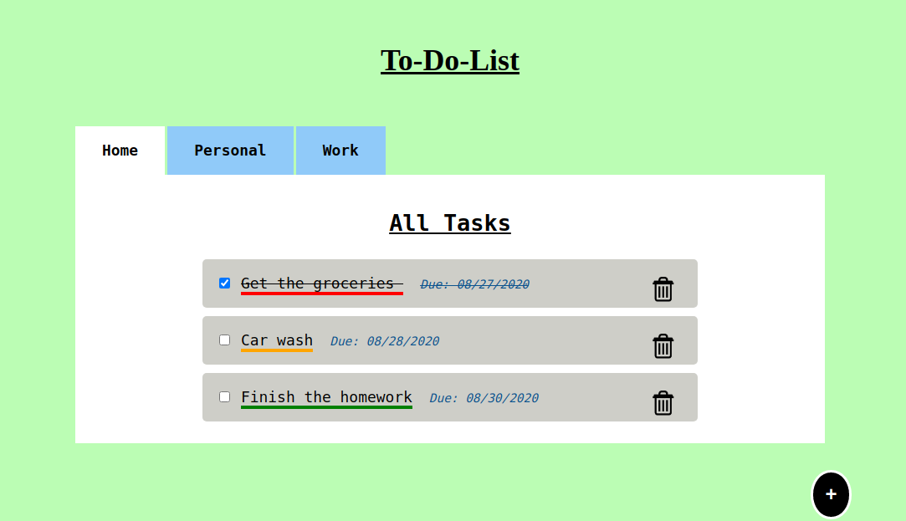

# ToDoList

 My ToDoList application lets the user create tasks of two types: Work and Personal.
 All the tasks will be displayed on the home page, and work tasks will be displayed 
 on work tab and the personal tasks will be diplayed on personal tab.
 The user can also add extra details such as due date and prirorty of the given task.
 The application makes an element according to the details provided by the user, i.e
 if the priority is high, medium or low then the task will have an underline of 
 red, orange or green respectively. If the task is complete the user can either 
 cross it off or delete it.

 NOTE: This project is not fully complete, I still have to work on it.
 
 Link: https://ruchik03.github.io/ToDoList/
 
  
